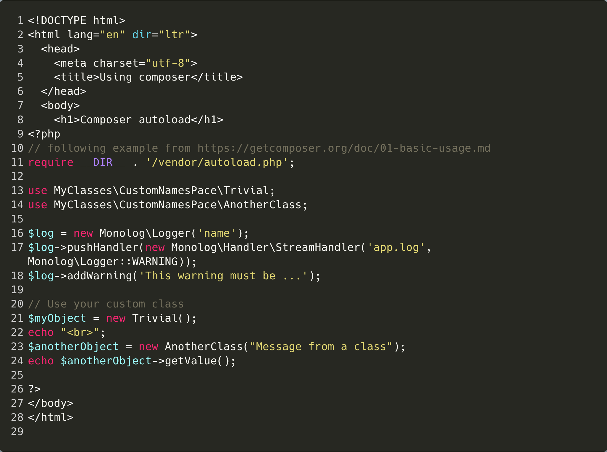
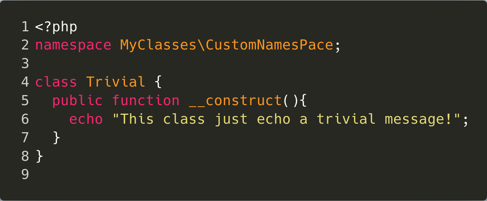

# composer
[Run example](#run-example)
## How to use autoload
Create a composer.json file and include some library e.g. monolog:

    {
        "require": {
             "monolog/monolog": "1.0.*"
        }
    }

After that run `composer install` inside the project root

Now you can include the autoload file wherever you need it, just put the following at the beginning of the php file
 `require __DIR__ . '/vendor/autoload.php';`

## How to include your own classes in the autoload file

Create an `src` directory and put your classes inside

Use a `namespace` e.g. `CustomNamesPace`

Just include the path in the composer.json:

    {
      "autoload":{
        "psr-4": {"CustomNamesPace\\":"src/"}
        }
    }

(Pleas note that the example diverges from the actual code. Inside the `src` directory there has been created one directory which contains some classes, in order to make the example more 'realistic', although we believe is quite clear how this works, here the actual composer.json)

    {
        "autoload":{
          "psr-4": {
            "MyClasses\\":"src/"
          }
        }
      }

run `composer dumpautoload -o`

Include this line in your php file:
`require __DIR__ . '/vendor/autoload.php';`

## index.php

## custom class

##  Run example
1. install [composer](https://getcomposer.org/download/)
2. clone this repo: git clone
3. Inside the root directory run `composer install`
4. Inside the root directory run `php -S localhost:9000`
5. In your favourite web browser type `localhost:9000` in the address bar
6. You should see this:

